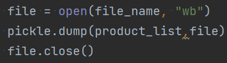

Jon Larson

08-30-2022

Foundations of Programming: Python

Assignment 08

https://github.com/jtlarson/IntroToProg-Python-Mod08

# Classes and Objects

## Introduction

The goal of this assignment is work with classes and objects to create a
program that can load and save data to a file, and display and create
new data object using custom classes. The starter file provided for this
project provides some docstrings for two of the three classes which hint
at the structure, but creating the classes and main body code is left to
the student. I will discuss my development process for the classes and
give operational examples of the code in PyCharm and PowerShell.

## Code Explanation

The assignment this week builds on what was done last week by using a
custom class ("Product") to store data instead of a dictionary. Beyond
that, the changes from my week 7 assignment are superficial---dealing
with 'product' and 'price' instead of 'sandwich toppings.' Due to this
similarity, I was able to re-use the majority of my code for
loading/saving files and user input/output. The process that I used for
adapting my old code followed this rough outline:

-   Insert *all* re-used code into the template and use refactor/replace
    tools to rename variables to match need of new program template. I
    try to be generous in what code I insert so that I can be sure the
    refactoring will find and update all instances of a keyword in one
    scan, and it's easy to delete unnecessary code later.

-   Where modification of logic is necessary, I often copied independent
    functions to a test file where I could provide test inputs and
    modify/test the logic in a simplified environment. Once testing is
    complete, I can copy the functions back into the main program and
    update the docstring or other dependencies based on the changes
    made.

    -   A good example of this was the 'show_current_product()'
        function. I was able to set a known input and test the code to
        achieve my desired output format without the difficulty of
        running through the program menus and entering data.

-   I then work on new code that will fill in the gaps in my existing
    code and any functional elements provided in the template.

-   Once code is functional, I go back through and add/update docstrings
    and comments to ensure they are as accurate and helpful as possible.

The majority of new code in this assignment was to create a "Product"
data class that would be able to store 'product name' and 'price' in
class objects created when the user loads data from a file or enters a
new product. Fortunately, our lesson this week covered creating a
similar class that would hold a person's first and last names, and it
wasn't a complicated process to adapt that same class structure to save
a product and price instead. The primary difference was that the data
validation tests needed to be changed to fit the different expectations
for product names and floating point values (Figure 1). A first or last
name is probably no going to have numbers, but a product name certainly
might. Because of this, I relaxed my data validation for the product
name to only require 'ascii' characters. For the price attribute, I
accept any value that can be stored as a floating point value.

**Figure 1 - Properties and data validation in Product class**

The "FileProcessor" class re-uses static load and save functions that I
delevoped for the previous assignment. These functions utilize the
pickle module to store the products as objects instead of converting the
data to another format. That allows for simplified code, as can be seen
in the three simple lines necessary to save to file (excluding exception
handling) in Figure 2 below:

**Figure 2 - Saving product objects to file**

The "IO" class is also largely based on code I created for the previous
assignment, but modified presentation formatting and messages to fit the
current script. I use 'while' loops combined with conditional statements
in the 'input_product' method. If the user input 'fails' the exception,
then I am able to give a helpful suggestion regarding formatting and the
while loop prompts them to try again. I use a similar 'else' statement
at the end of the 'Main Body' code to handle any invalid input at the
menu selection prompt.

## Running the code

You can see a screenshot of the program running in Powershell in Figure
3 below:

**Figure 3 - Viewing, adding, saving data to file in Powershell**

### Running in PyCharm

Below (Figure 4) is another screenshot of the program in
operation---this time in PyCharm. You can see the 'widget' data that was
loaded from the Powershell instance:

**Figure 4 - Program viewing saved data in PyCharm**

## Summary

In this document I described my process for creating this program in a
manageable way by integrating established code and testing functions in
a separate file where results can be obtained more quickly and variables
can be limited to the code being tested. I also described the
development of a custom data class and the steps I took to validate
inputs and deal with invalid input in a helpful manner I also
demonstrated the program operation in PowerShell and PyCharm.
